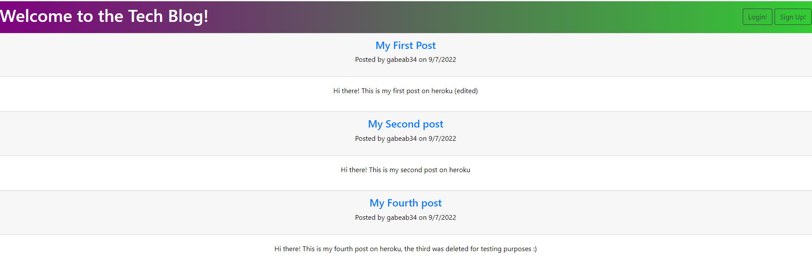

  # Tech Blog

  

  ## Table of Contents:

  * [Description](#Description)

  * [Installation](#Installation)

  * [Usage](#Usage)

  * [Contributions](#Contributions)

  * [Test](#Tests)

  * [Email](#Questions)

  * [Github](#Questions)

  ## Description: 
  This project follow the MVC paradigm and uses handlebars, sequelize and express to create a CMS style blog site where people can post blog entries and comments

  ## Installation: 
  npm i, npm i bcypt, npm i mysql2, npm i sequelize, npm i express-handlebars, npm i express-session
  
  ## Usage: 
  Deployed on Heroku: https://techblog-gab.herokuapp.com/

  ## License:
  none 
  

  ## Contributions: 
  No contributions needed

  ## Tests: 
  No tests needed

  ## Questions:

  [Email](mailto:gabeab34@gmail.com)

  [GitHub](https://github.com/gabeab34)

